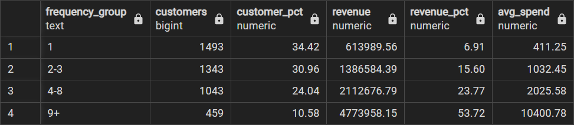
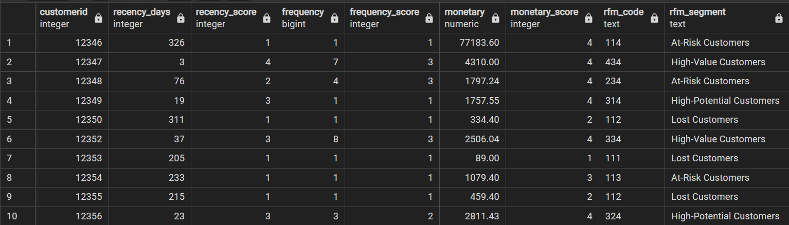
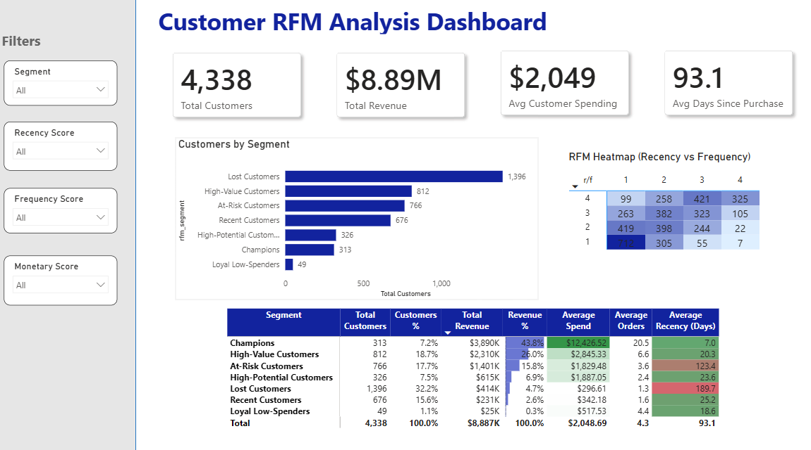

# RFM Segmentation & Cohort Analysis

**Tools:** Python · PostgreSQL · Power BI

## Introduction

This project analyses transactional e-commerce data (December 2010 – November 2011) to understand customer retention and provide segmentation-based recommendations. Data was cleaned in Python, analysed in PostgreSQL, and visualised in Power BI.

## Methodology

| Approach | Purpose |
|---|---|
| **RFM Segmentation** | Behavioural segmentation: answers "who are my customers *today*?" |
| **Cohort Analysis** | Captures distinct customer behaviors and retention trends over time that an RFM snapshot may miss |

### RFM: Recency, Frequency, Monetary

RFM segments customers using three metrics:

- **Recency (R):** Days between a customer's last purchase and the analysis date
- **Frequency (F):** Total number of purchases per customer
- **Monetary (M):** Total amount spent per customer

**Workflow:**
1. Clean the data
2. Calculate R, F, M for each customer
3. Assign scores to each metric
4. Combine scores into an RFM code
5. Segment customers based on their scores
6. Target each segment with a tailored retention strategy

## Data Dictionary

| Column | Description |
|---|---|
| `InvoiceNo` | Invoice/transaction identifier |
| `StockCode` | Product code |
| `Description` | Product description |
| `Quantity` | Units purchased |
| `InvoiceDate` | Timestamp of transaction |
| `UnitPrice` | Price per unit |
| `CustomerID` | Unique customer identifier |
| `Country` | Customer country |
| `TotalPrice` | Derived: `Quantity * UnitPrice` |

## Data Cleaning (Python)

Performed in [`data_cleaning.ipynb`](./data_cleaning.ipynb):

- Handling missing values
- Removing duplicates
- Fixing data entry errors
- Converting data types
- Reviewing summary statistics and outliers
- Created 'TotalPrice' column

## SQL: RFM Segmentation (PostgreSQL)

Cleaned data was loaded into PostgreSQL for RFM calculation and segmentation.

### 1. Create the transactions table

```sql
CREATE TABLE transactions (
    InvoiceNo    TEXT,
    StockCode    TEXT,
    Description  TEXT,
    Quantity     INTEGER,
    InvoiceDate  TIMESTAMP,
    UnitPrice    NUMERIC(10,2),
    CustomerID   INTEGER,
    Country      TEXT,
    TotalPrice   NUMERIC(12,2)
);
```

### 2. Set the analysis date

```sql
SELECT MAX(invoicedate)
FROM transactions;
-- Output: 2011-12-09 12:50:00
-- Analysis date used: 2011-12-10
```

### 3. Determine Recency and Monetary quartiles

```sql
WITH recency AS (
    SELECT
        customerid,
        DATE '2011-12-10' - MAX(invoicedate)::date AS recency_days
    FROM transactions
    GROUP BY customerid
)
SELECT
    PERCENTILE_CONT(ARRAY[0.25, 0.50, 0.75])
    WITHIN GROUP (ORDER BY recency_days) AS recency_quartiles
FROM recency;
-- Output: {18, 51, 143}
```

```sql
WITH monetary AS (
    SELECT
        customerid,
        SUM(totalprice) AS monetary
    FROM transactions
    GROUP BY customerid
)
SELECT
    PERCENTILE_CONT(ARRAY[0.25, 0.50, 0.75])
    WITHIN GROUP (ORDER BY monetary) AS monetary_quartiles
FROM monetary;
-- Output: {306.48, 668.57, 1660.60}
```

### 4. Determine Frequency buckets

Frequency had no natural breakpoint, so several groupings were tested. The final buckets (`1`, `2-3`, `4-8`, `9+`) were chosen because they produced balanced group sizes while isolating a small, high-value segment - where the 9+ group refers to the **10.6% of customers driving 53.7% of total revenue**.

```sql
WITH customer_summary AS (
    SELECT
        customerid,
        COUNT(DISTINCT invoiceno) AS frequency,
        SUM(totalprice) AS monetary
    FROM transactions
    GROUP BY customerid
),
frequency_groups AS (
    SELECT
        customerid,
        monetary,
        CASE
            WHEN frequency = 1 THEN '1'
            WHEN frequency BETWEEN 2 AND 3 THEN '2-3'
            WHEN frequency BETWEEN 4 AND 8 THEN '4-8'
            ELSE '9+'
        END AS frequency_group
    FROM customer_summary
)
SELECT
    frequency_group,
    COUNT(*) AS customers,
    ROUND(100.0 * COUNT(*) / SUM(COUNT(*)) OVER (), 2) AS customer_pct,
    ROUND(SUM(monetary), 2) AS revenue,
    ROUND(100.0 * SUM(monetary) / SUM(SUM(monetary)) OVER (), 2) AS revenue_pct,
    ROUND(AVG(monetary), 2) AS avg_spend
FROM frequency_groups
GROUP BY frequency_group
ORDER BY
    CASE frequency_group
        WHEN '1' THEN 1
        WHEN '2-3' THEN 2
        WHEN '4-8' THEN 3
        WHEN '9+' THEN 4
    END;
```
<p align="center">  </p>

### 5. Score each customer (1 = worst, 4 = best)

Note: for Recency, a lower number of days is better (score 4). For Frequency and Monetary, a higher value is better (score 4).

```sql
CREATE VIEW rfm_view AS

WITH recency AS (
    SELECT
        customerid,
        DATE '2011-12-10' - MAX(invoicedate)::date AS recency_days
    FROM transactions
    GROUP BY customerid
),
recency_score AS (
    SELECT
        customerid,
        recency_days,
        CASE
            WHEN recency_days <= 18 THEN 4
            WHEN recency_days <= 51 THEN 3
            WHEN recency_days <= 143 THEN 2
            ELSE 1
        END AS recency_score
    FROM recency
),
frequency AS (
    SELECT
        customerid,
        COUNT(DISTINCT invoiceno) AS frequency
    FROM transactions
    GROUP BY customerid
),
frequency_score AS (
    SELECT
        customerid,
        frequency,
        CASE
            WHEN frequency = 1 THEN 1
            WHEN frequency BETWEEN 2 AND 3 THEN 2
            WHEN frequency BETWEEN 4 AND 8 THEN 3
            ELSE 4
        END AS frequency_score
    FROM frequency
),
monetary AS (
    SELECT
        customerid,
        SUM(totalprice) AS monetary
    FROM transactions
    GROUP BY customerid
),
monetary_score AS (
    SELECT
        customerid,
        monetary,
        CASE
            WHEN monetary <= 306.48 THEN 1
            WHEN monetary <= 668.57 THEN 2
            WHEN monetary <= 1660.60 THEN 3
            ELSE 4
        END AS monetary_score
    FROM monetary
)

SELECT
    r.customerid,
    r.recency_days,
    r.recency_score,
    f.frequency,
    f.frequency_score,
    m.monetary,
    m.monetary_score,
    CONCAT(r.recency_score, f.frequency_score, m.monetary_score) AS rfm_code
FROM recency_score r
JOIN frequency_score f USING (customerid)
JOIN monetary_score m USING (customerid);
```


### 6. Segment customers

| Segment | Logic |
|---|---|
| Champions | R=4, F=4, M=4 |
| High-Value Customers | R≥3, F≥3, M≥3 (not all 4s) |
| Loyal Low-Spenders | R≥3, F≥3, M≤2 |
| High-Potential Customers | R≥3, F≤2, M≥3 |
| Recent Customers | R≥3, F≤2, M≤2 |
| At-Risk Customers | R≤2, F≥3 or M≥3 |
| Lost Customers | R≤2, F≤2, M≤2 |

```sql
CREATE VIEW rfm_segmented AS
SELECT *,
    CASE
        WHEN recency_score = 4 AND frequency_score = 4 AND monetary_score = 4
            THEN 'Champions'
        WHEN recency_score >= 3 AND frequency_score >= 3 AND monetary_score >= 3
            THEN 'High-Value Customers'
        WHEN recency_score >= 3 AND frequency_score >= 3 AND monetary_score <= 2
            THEN 'Loyal Low-Spenders'
        WHEN recency_score >= 3 AND frequency_score <= 2 AND monetary_score >= 3
            THEN 'High-Potential Customers'
        WHEN recency_score >= 3 AND frequency_score <= 2 AND monetary_score <= 2
            THEN 'Recent Customers'
        WHEN recency_score <= 2 AND (frequency_score >= 3 OR monetary_score >= 3)
            THEN 'At-Risk Customers'
        WHEN recency_score <= 2 AND frequency_score <= 2 AND monetary_score <= 2
            THEN 'Lost Customers'
        ELSE 'Other'
    END AS rfm_segment
FROM rfm_view;
```

```sql
SELECT
    rfm_segment,
    COUNT(*) AS customers,
    ROUND(100.0 * COUNT(*) / SUM(COUNT(*)) OVER (), 1) AS pct_of_total,
    ROUND(AVG(monetary), 2) AS avg_spend,
    ROUND(AVG(frequency), 2) AS avg_orders,
    ROUND(AVG(recency_days), 1) AS avg_days_since_purchase
FROM rfm_segmented
GROUP BY rfm_segment
ORDER BY avg_spend DESC;
```
<p align="center">  </p>

### Segment Definitions

- **Champions**: the most valuable and highly engaged customers
- **High-Value Customers**: active customers who consistently spend a lot
- **High-Potential Customers**: high-spending customers with strong potential to become loyal
- **Loyal Low-Spenders**: frequent purchasers who spend relatively little
- **Recent Customers**: recently active customers who have not yet developed frequent purchasing or high spending
- **At-Risk Customers**: previously valuable or engaged customers whose activity is declining
- **Lost Customers**: formerly active customers who are now inactive and ave low historical value

## PowerBI Dashboard
<p align="center">  </p>

## SQL: Cohort Analysis (PostgreSQL)

- **Cohort month:** the month a customer first made a purchase
- **Cohort index:** number of months elapsed between a customer's cohort month and any given purchase

```sql
CREATE VIEW cohort_data_view AS

WITH cohort AS (
    SELECT
        customerid,
        MIN(DATE_TRUNC('month', invoicedate)::date) AS cohort_month
    FROM transactions
    GROUP BY customerid
),
customer_month AS (
    SELECT
        customerid,
        DATE_TRUNC('month', invoicedate)::date AS invoice_month,
        SUM(totalprice) AS revenue
    FROM transactions
    GROUP BY customerid, DATE_TRUNC('month', invoicedate)::date
)

SELECT
    cm.customerid,
    c.cohort_month,
    cm.invoice_month,
    cm.revenue,
    (
        EXTRACT(YEAR FROM AGE(cm.invoice_month, c.cohort_month)) * 12
        + EXTRACT(MONTH FROM AGE(cm.invoice_month, c.cohort_month))
    )::int AS cohort_index
FROM customer_month cm
JOIN cohort c ON cm.customerid = c.customerid;
```

Additional queries against `cohort_data_view` (see [`cohort_analysis.sql`](./cohort_analysis.sql)) power the following Power BI visualizations:

- **Retained customers** — count of active customers per cohort per month
- **Retention rate** — % of a cohort still active in a given month (notable spike in November)
- **Revenue by cohort** — "How much revenue did this cohort generate in this specific month?"
- **Cumulative revenue** — "How much money has this cohort brought us since they joined?" (via `PARTITION BY`)
- **Average customer lifetime value by cohort**

## Next Steps

- K-means clustering to validate/refine RFM segments
- Segment-specific retention campaign recommendations
